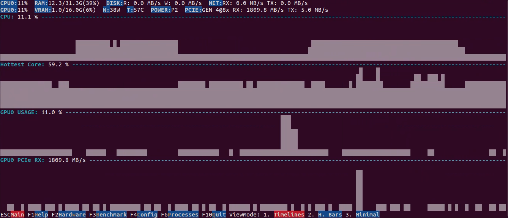

#  AI-Z

[](https://github.com/ai-z/ai-z/actions/workflows/ci.yml)
[](https://github.com/ai-z/ai-z/actions/workflows/ci-linux.yml)
[](https://github.com/ai-z/ai-z/actions/workflows/ci-windows.yml)

Terminal app for real-time monitoring of CPU/NPU/GPU performance timelines and AI related benchmarks. Supports AMD/Intel/NVIDIA. Provides many metrics all in one app to provide a holistic view including PCIE bandwidth, GPU Memory Controller usage, hottest core utilization, disk, network. Benchmarks CUDA, Vulkan, OpenCL and ONNX

| N/GPU   | Linux | Windows |
|-------|:-----:|:-------:|
| NVIDIA | ✓ | ✓ |
| AMD | ✓* | ✓* |
| Intel | ✓* | ✓* |

\* some metrics are missing



## Install
### Ubuntu/Debian
```shell
echo "deb [trusted=yes] https://www.ai-z.org/ stable main" | sudo tee /etc/apt/sources.list.d/ai-z.list
sudo apt update
sudo apt install ai-z
```

### Windows 10/11

Download either the portable ZIP or the installer from the latest GitHub Release:

[Latest GitHub Release](https://github.com/ai-z/ai-z/releases/latest)

Direct downloads (always point at the latest release):

- [Portable ZIP (x64)](https://github.com/ai-z/ai-z/releases/latest/download/ai-z-windows-x64.zip)
- [Installer (x64)](https://github.com/ai-z/ai-z/releases/latest/download/ai-z-windows-x64-setup.exe)

- Portable: unzip and run `ai-z.exe`
- Installer: run `ai-z-windows-x64-setup.exe`

#### Intel GPU metrics

On Intel Arc/Iris GPUs, metrics are queried via Intel Graphics Control Library (IGCL) and Windows D3DKMT API:

**Supported metrics:**
- Temperature (°C)
- Power draw (W) - via D3DKMT
- GPU utilization (%)
- GPU/Memory clock speed (MHz)
- Fan speed (RPM)
- VRAM temperature (°C)
- Throttle state (power/thermal limiting)

**Known limitations:**
- **PCIe link info**: The IGCL `ctlPciGetState()` API may return error `0x40000019` on some systems. This is a [known Intel issue](https://github.com/intel/drivers.gpu.control-library/issues/115). The app attempts to fall back to Windows SetupAPI, but some Intel drivers don't report accurate PCIe link speed/width.
- If you see `PCIE:--` in the UI, this is expected on affected systems.

**Troubleshooting:**
1. Update to the latest Intel GPU driver.
2. Run `ai-z.exe --diag-igcl-full` to verify IGCL is working and see available metrics.

## Build

### Linux

```bash
sudo apt-get install -y build-essential cmake ninja-build pkg-config git
git clone https://github.com/microsoft/vcpkg.git
./vcpkg/bootstrap-vcpkg.sh
cmake -S . -B build -DCMAKE_TOOLCHAIN_FILE=./vcpkg/scripts/buildsystems/vcpkg.cmake
cmake --build build -j
./build/ai-z
```

Optional (developer): enable extra compiler warnings:

```bash
cmake -S . -B build -DAI_Z_ENABLE_WARNINGS=ON
cmake --build build -j
```

### Build a `.deb`

Prereqs:

```bash
sudo apt-get install -y build-essential cmake dpkg-dev
```

Build + package:

```bash
cmake -S . -B build -DCMAKE_BUILD_TYPE=Release
cmake --build build -j
cpack --config build/CPackConfig.cmake -G DEB
```

Note: If you want the resulting `.deb` to install on Ubuntu 22.04, build the
package on Ubuntu 22.04 (or in a 22.04 container/chroot). Building on newer
distros (e.g. 24.04+) will produce a package that depends on newer `libc6` and
`libstdc++6` versions and will not be installable on 22.04.

This produces something like `ai-z_0.1.0_amd64.deb` in the build directory.

### Install locally

For local installs (or downloading from a release page), users can install via apt:

```bash
sudo apt install ./ai-z_0.1.0_amd64.deb
```

### Windows

**Prerequisites:**
- Visual Studio 2022 with C++ development tools
- CMake 3.16+
- Git

**Build:**

1. Clone the vcpkg package manager and bootstrap it:

```powershell
git clone https://github.com/microsoft/vcpkg.git
.\vcpkg\bootstrap-vcpkg.bat
```

3. Configure and build ai-z with Visual Studio:

```powershell
cmake -S . -B build -G "Visual Studio 17 2022" -A x64 `
  -DCMAKE_TOOLCHAIN_FILE=.\vcpkg\scripts\buildsystems\vcpkg.cmake
cmake --build build --config Release
```

**Run:**

```powershell
.\build\Release\ai-z.exe
```

The TUI application will launch in your terminal. Use:
- Arrow keys or vim-style keys to navigate
- `q` or `Ctrl+C` to quit
- Check the UI for additional keyboard shortcuts
